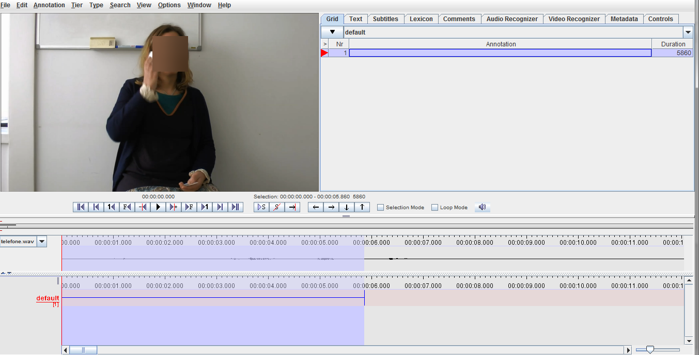
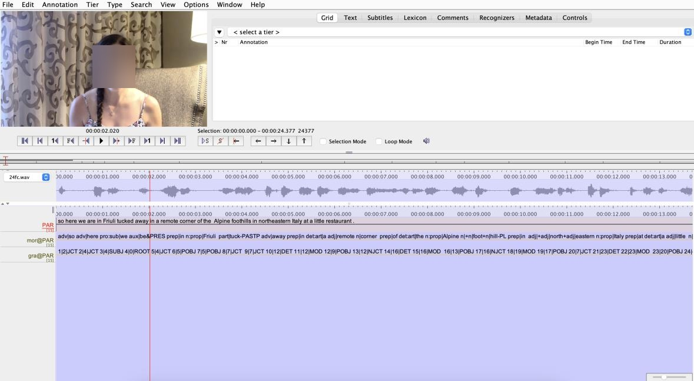
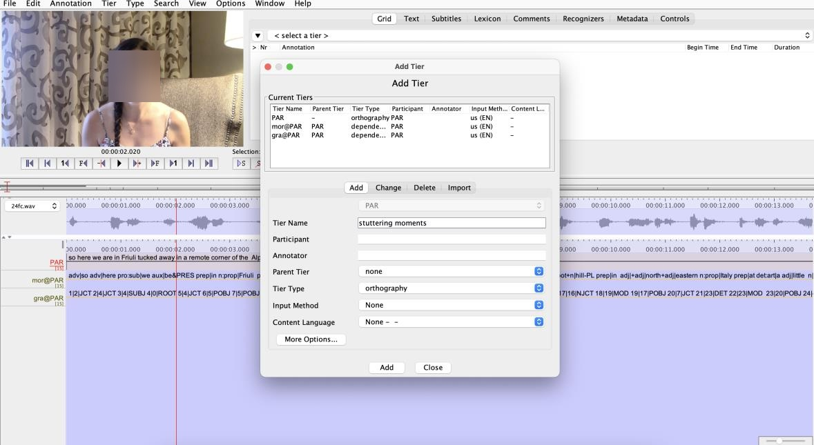
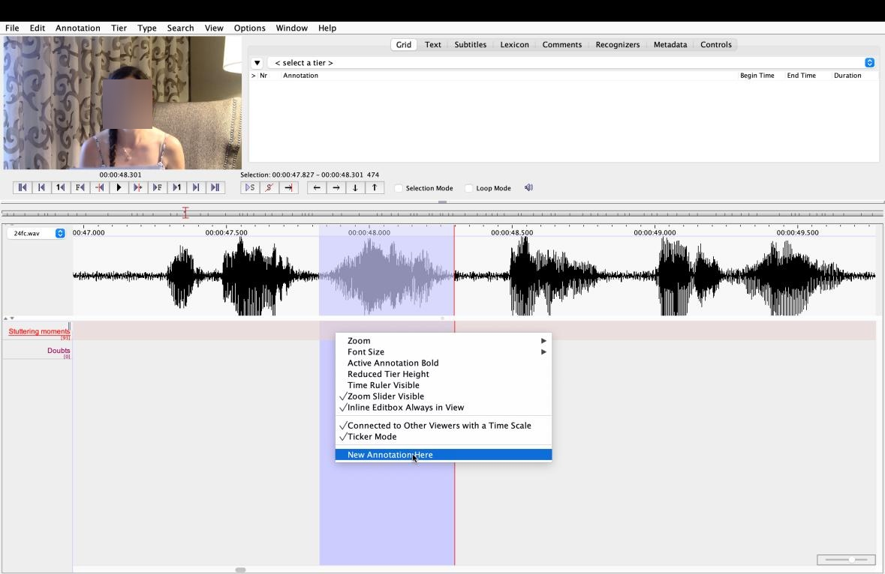
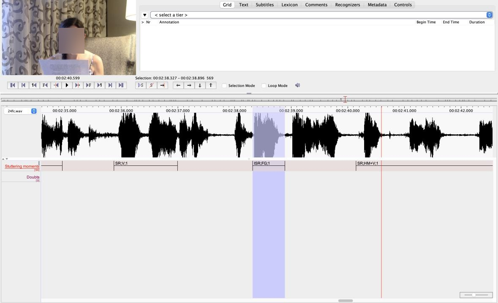
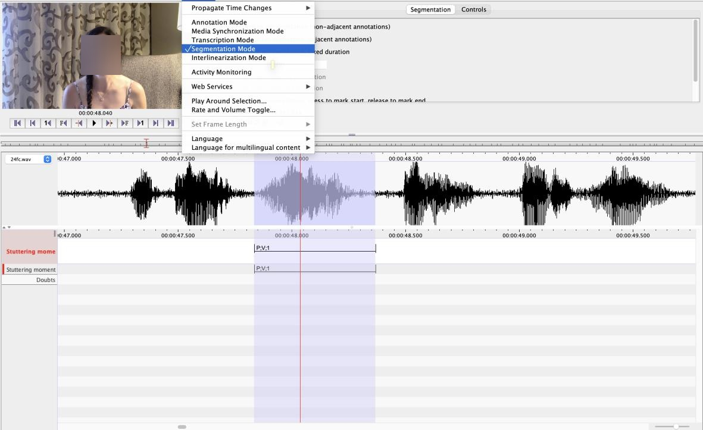
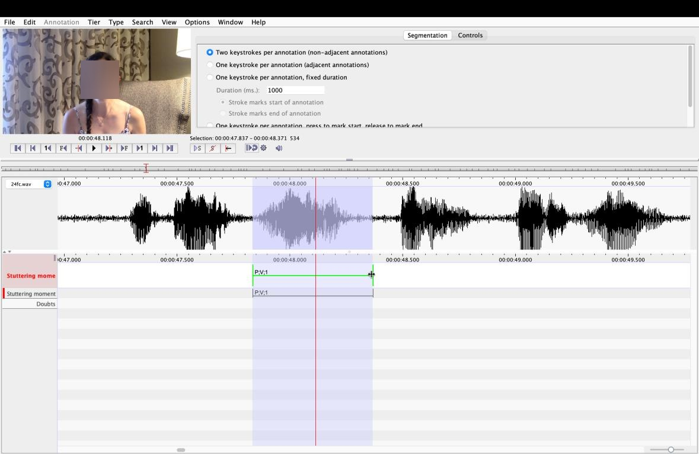

<h1> Annotation Guidlines </h1>

> *The following Guideline was shared with the annotators* 

<h1 align="center">Stuttering analysis on ELAN program</h1>

The ELAN program is a tool developed on Max Planck Institute for Psycholinguistics which allows the creation of annotations on video and audio resources. The application can be downloaded [here](https://archive.mpi.nl/tla/elan/download)

The ELAN program's workspace (referred to as Annotation Mode) consists of an area where the video is displayed (upper left corner), next to which are the program's controls. Below the video display area are the video playback controls and the commands for playing selected parts of the video. At the bottom, there are several tiers where annotations of stuttering moments will be made. The default tier appears whenever the examiner opens the ELAN program. On the right side of the video, there are several tabs where the information contained in the existing tier(s) can be viewed.

### Step-by-step on ELAN program to analyze and characterize stuttering moment

1. The files are available [here](https://mbzuaiac-my.sharepoint.com/personal/hanan_aldarmaki_mbzuai_ac_ae/Documents/Forms/All.aspx?web=1&FolderCTID=0x012000DADF2E9ADCCDF147908DB396B9DBE845&id=%2Fpersonal%2Fhanan%5Faldarmaki%5Fmbzuai%5Fac%5Fae%2FDocuments%2FStutterBank%2FFluencyBank%2DData%2FVoices%2DAWS)

2. Download the files for your computer;

3. Select an *.eaf file

4. Add a new tier (Tier-Add New Tier) and name it (e.g., “stuttering moments”).

5. Add another tier named “Doubts”. This tier allows you to write down any doubts that arise during certain moments of stuttering.

6. Play the speech sample one time to familiarize with it;

7. Select each stuttering event by dragging the cursor along the stuttering moment. Each selected moment could be played again;

8. It should be used the information of the waveform to make a reliable identification of stuttering events. It is recommended to use the zoom function on the waveform (between 300% and 500%, stereo channels, merged) to improve visualization, as the waveform provided by the ELAN software has low amplitude. In case of doubt, the examiner may open the full speech sample or the selected segment with the Praat software.
    a. The duration of repeated movements should be measured from the point where the repeated sound begins until the cessation of the repeated movement. The following examples illustrate the start and end of the stuttering moment (represented by []): “He [we-we-we] went to the beach” or “I [don't-don't-don't] want to go home.”
    b. For stuttering moments that contain fixed postures (i.e., prolongations or blocks), the start should be considered the point where the disfluent sound begins, and the end of the moment occurs when the following sound begins. The following examples illustrate the start and end of the stuttering moment (represented by []): “I saw a [ssssssss]nake” or “That[______] tree is beautiful.”

9. With the right bottom, select “new annotation here” and write in the tier the core behavior classification, the secondary behavior classification and the classification of the tension degree, separated by “;”

    **Core behaviors** can be classified using the following categories (LBDL taxonomy):
    - Syllable Repetition (SR): the entire syllable is repeated, e.g.,"can…can…can…" or "po…po…po…po…potato"
    - Multisyllabic Unit Repetition (MUR): involves more than one syllable, e.g., “I went…I went…I went…I went… to Los Angeles” or “I buy one pot… pot…pot… pot… one potato”
    - fixed postures with audible airflow (i.e., prolongations, P), e.g., “I went toSSSSSSidney”
    - fixed postures with inaudible airflow (blocks, B), e.g., “I buy one ____potato”

    *NOTE1: Sometimes, people who stutter (PWS) may experience a stutteringmoment which they end with a prolongation (i.e., a pull-out). When we identify the stuttering moment, we include this "prolongation" as part of it,but we do not classify it specifically as a prolongation.*

    **Secondary behaviors** can be classified as:

    - Verbal (V): noisy breathing, whistling, sniffing, blowing, clicking sounds;
    - Facial grimaces (FG): Jaw jerking, tongue protruding, lip pressing, jawmuscles tense, eye movements;
    - Head movements (HM): Back, forward, turning away;
    - Movements of the extremities (ME): Arm and hand movement, hands aboutface, torso movement, leg movement…

    *NOTE2: In the case of a co-occurrence of several core behaviors orseveral secondary behaviors, please add a “+” between the abbreviations.*

    **Tension level** is classified on a scale from 0 to 3. The classification chosen foranalyzing the severity of secondary behaviors was based on Boey et al. (2007).The severity classification is as follows:
    - 0: Absence of tension;
    - 1: Subtle degree of tension;
    - 2: Moderate degree of tension, indicating that signs of tension areimmediately distracting and produced with visible effort;
    - 3: Severe degree of tension, indicating that signs of tension are highlydistracting and produced with significant effort

10. The rater could modify the annotation; with the right bottom, select “ModifyAnnotation Value” and add a new annotation value.

11. The rater could also modify the length of the annotation. The best way to do that is on the “segmentation mode” (Options-Segmentation Mode). The tier where the annotations are should be selected (double click on it) and the annotation becomes green. By dragging the arrow, it is possible to change the beggining and end of each annotation.

